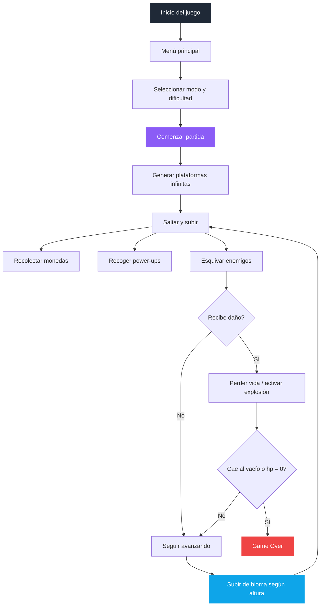

# 👻 The Ghost Jump - El Fantasma Saltador


---

## Imagen principal

<div align="center">
  
</div>

---

## Web en vivo

<div align="center">
  <a href="https://jhormancastella.github.io/The-Ghost-jump-/" target="_blank">
    
  </a>
</div>

---

## Descripción

**The Ghost Jump** es un juego web estilo **infinite jumper / vertical platformer** donde controlas a un fantasma que debe ascender lo más alto posible, saltando entre plataformas, esquivando enemigos, recolectando monedas y aprovechando power-ups.

El proyecto está desarrollado como una experiencia **web responsive**, con base lista para seguir creciendo hacia una versión más completa con soporte para móviles, audio, PWA y empaquetado futuro como aplicación.

---

## Características principales

- **Múltiples biomas dinámicos** según la altura:
  - 🌌 Noche
  - ❄️ Hielo
  - 🌋 Lava
  - ☁️ Cielo

- **Sistema de dificultad**:
  - 🌱 Clásico
  - ⚡ Medio
  - 💀 Difícil

- **Sistema de vidas**:
  - El fantasma resiste **2 golpes**
  - Si cae al vacío, muere instantáneamente

- **Sprites personalizados**:
  - Estado normal
  - Estado explotado

- **Power-ups**:
  - ⚡ Supersalto
  - 🛡️ Armadura

- **Skins dinámicas**:
  - Cambian visualmente según la puntuación

- **Controles flexibles**:
  - ⌨️ Teclado
  - 📱 Botones táctiles
  - 🎯 Sensor de movimiento / inclinación (tilt)

- **Multilenguaje**:
  - 🇪🇸 Español
  - 🇺🇸 Inglés

- **Diseño responsive / mobile-friendly**

- **Base preparada para crecimiento futuro**:
  - Web App
  - mejoras PWA
  - empaquetado Android
  - empaquetado escritorio

---

## Vista rápida del juego

| Característica | Estado |
|---|---|
| Menú principal | ✅ |
| Dificultades | ✅ |
| Biomas dinámicos | ✅ |
| Power-ups | ✅ |
| Monedas | ✅ |
| Vidas / daño | ✅ |
| Sprites personalizados | ✅ |
| Idioma ES / EN | ✅ |
| Sensor de movimiento | ✅ |
| Multijugador real | 🚧 |
| Audio completo | 🚧 |
| APK / EXE | 🔜 |

---

## Sprites del personaje

### Sprite principal


### Sprite explotado


---

## Flujo general del juego



---

## Tecnologías utilizadas

- **HTML5**: estructura principal de la aplicación
- **CSS3**: estilos, animaciones, menús y diseño responsive
- **JavaScript (ES6+)**: lógica del juego, colisiones, HUD e interfaz
- **Canvas 2D API**: renderizado del juego
- **DeviceOrientation API**: control por inclinación en dispositivos móviles
- **LocalStorage**: guardado de récord, idioma y ajustes futuros

---

## Estructura del proyecto

### Estructura actual
```text
/
├── index.html
├── README.md
├── robots.txt
├── sitemap.xml
└── site.webmanifest
```

### Estructura modular recomendada a futuro
```text
the-ghost-jump/
├── index.html
├── README.md
├── robots.txt
├── sitemap.xml
├── site.webmanifest
├── css/
│   └── styles.css
├── js/
│   ├── config.js
│   ├── i18n.js
│   ├── ui.js
│   ├── controls.js
│   ├── audio.js
│   └── game.js
├── assets/
│   ├── images/
│   │   ├── ghost-normal.png
│   │   ├── ghost-exploded.png
│   │   └── screenshots/
│   └── sounds/
├── android/
├── electron/
└── dist/
```

---

## Instalación y ejecución local

### Opción 1: abrir directamente
Abre `index.html` en tu navegador.

### Opción 2: usar servidor local
```bash
npx serve .
```

---

## Controles del juego

### Teclado

| Tecla | Acción |
|---|---|
| `←` o `A` | Mover a la izquierda |
| `→` o `D` | Mover a la derecha |
| `P` | Pausar / continuar |
| `ESC` | Pausa |

### Móvil

| Control | Acción |
|---|---|
| Botones táctiles | Movimiento izquierda / derecha |
| Toque lateral en pantalla | Movimiento lateral |
| Sensor de inclinación | Movimiento por tilt |

---

## Sistema de idioma

El juego incluye soporte multilenguaje:

- **Español**
- **Inglés**

El idioma se cambia desde el menú de **Ajustes**, lo cual mejora la presentación profesional del proyecto y facilita su evolución a versiones más completas para móviles y escritorio.

---

## Sensor de movimiento en móviles

El juego puede usar el **sensor de inclinación del celular** para mover al personaje.

### Compatibilidad
- **Android**: normalmente funciona directamente
- **iPhone / iOS**: requiere permiso explícito del usuario

### Activación
1. Ir a **Ajustes**
2. Activar **Control por movimiento**
3. Pulsar **Activar sensor**

---

## Sistema de audio

El proyecto está preparado para integrar:

- Música de fondo
- Sonido de salto
- Sonido de monedas
- Sonido de power-ups
- Sonido de daño
- Sonido de game over

### Estructura sugerida
```text
assets/sounds/
├── bg-music.mp3
├── jump.mp3
├── coin.mp3
├── powerup.mp3
├── hit.mp3
└── gameover.mp3
```

---

## Empaquetado futuro

### Windows (.exe)
Se podrá empaquetar usando **Electron**.

### Android (.apk)
Se podrá convertir usando **Capacitor** o **Cordova**.

### Recomendación
Para este proyecto, **Capacitor** es una excelente opción si quieres mantener una base web y luego exportarla a Android.

---

## SEO y publicación

El repositorio ya incluye una base útil para publicación web:

- `robots.txt`
- `sitemap.xml`
- `site.webmanifest`

Además, el proyecto usa favicon e imagen principal personalizada, lo que mejora su presentación de cara a despliegue y posicionamiento.

---

## Roadmap sugerido

- [x] Menú principal
- [x] Dificultades
- [x] Power-ups
- [x] Biomas por altura
- [x] Soporte ES / EN
- [x] Sensor de movimiento
- [x] Sprites personalizados
- [ ] Sistema de audio completo
- [ ] Guardado total de ajustes en localStorage
- [ ] Transiciones suaves entre biomas
- [ ] Nuevos enemigos por bioma
- [ ] Tienda / desbloqueo de skins
- [ ] Modo multijugador real
- [ ] PWA instalable más completa
- [ ] Build Android (.apk)
- [ ] Build Windows (.exe)

---

## Configuración futura recomendada

Si más adelante modularizas el proyecto, puedes usar una configuración como esta:

```javascript
window.GHOST_JUMP_CONFIG = Object.freeze({
  site: {
    name: "The Ghost Jump",
    description: "Juego de plataformas infinito con un fantasma saltador",
    locale: "es-CO",
    url: "https://jhormancastella.github.io/The-Ghost-jump-/"
  },
  gameplay: {
    defaultDifficulty: "easy",
    maxLives: 2,
    enableMotionControl: true
  },
  storageKeys: {
    bestScore: "ghostJumpBest",
    language: "ghostJumpLanguage",
    settings: "ghostJumpSettings"
  }
});
```

---

## Contribuciones

Las contribuciones son bienvenidas.

1. Haz fork del proyecto
2. Crea una rama:
   ```bash
   git checkout -b feature/mi-mejora
   ```
3. Realiza tus cambios
4. Haz commit
5. Abre un Pull Request

---

## Licencia

Este proyecto es de código abierto.  
Puedes usarlo, adaptarlo y mejorarlo libremente.

---

## Autor

jhorman Jesus castellanos morales  

